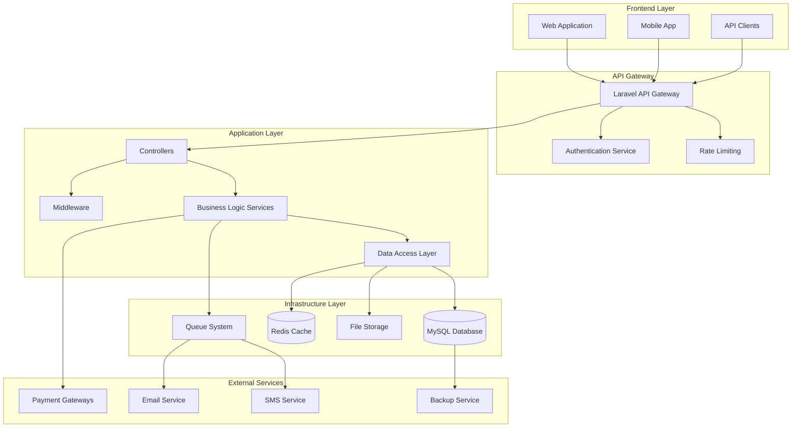

# eCare Healthcare Management System - Technical Documentation


A comprehensive healthcare management system built with Laravel PHP framework, designed to manage all aspects of a medical clinic including patient management, appointments, medical records, pharmacy operations, and financial transactions.

## 📋 Table of Contents

1. [System Overview](#-system-overview)
2. [Architecture](#️-architecture)
3. [Technology Stack](#️-technology-stack)
4. [Database Design](#️-database-design)
5. [API Documentation](#-api-documentation)
6. [Security Implementation](#-security-implementation)
7. [Performance & Scalability](#-performance--scalability)
8. [Integration Points](#-integration-points)
9. [Deployment Architecture](#-deployment-architecture)
10. [Monitoring & Logging](#-monitoring--logging)
11. [Development Guidelines](#-development-guidelines)
12. [Testing Strategy](#-testing-strategy)
13. [Getting Started](#-getting-started)

---

## 🎯 System Overview

**eCare** is a comprehensive healthcare management system built with Laravel PHP framework, designed to manage all aspects of a medical clinic including patient management, appointments, medical records, pharmacy operations, and financial transactions.

### Core Modules
- **User Management & Authentication**
- **Patient Management**
- **Doctor Management**
- **Appointment Scheduling**
- **Medical Records & Prescriptions**
- **Pharmacy Management**
- **Financial Management**
- **Content Management**
- **Reporting & Analytics**

### Key Features
- Role-based access control (Admin, Doctor, Patient, Staff)
- Multi-tenant architecture support
- Real-time notifications
- QR code integration for patient cards
- Multi-currency support
- Comprehensive audit trail
- RESTful API architecture

---

## 🏗️ Architecture

### High-Level Architecture



### Design Patterns

1. **Repository Pattern**: Data access abstraction
2. **Service Layer Pattern**: Business logic encapsulation
3. **Observer Pattern**: Event-driven notifications
4. **Strategy Pattern**: Payment processing
5. **Factory Pattern**: User type creation
6. **Decorator Pattern**: Permission handling

---

## 🛠️ Technology Stack

### Backend
- **Framework**: Laravel 10.x
- **Language**: PHP 8.1+
- **Database**: MySQL 8.0
- **Cache**: Redis 6.x
- **Queue**: Redis/Database

### Frontend
- **Framework**: Laravel Blade Templates
- **JavaScript**: Alpine.js / Vue.js 3
- **CSS**: Tailwind CSS / Bootstrap 5
- **Build Tool**: Vite
- **Icons**: Font Awesome

### Infrastructure
- **Web Server**: Nginx
- **Application Server**: PHP-FPM
- **Container**: Docker
- **Load Balancer**: Nginx/HAProxy

### Third-Party Services
- **Payment**: Stripe
- **Email**: SMTP
- **Storage**: Local Storage
- **Monitoring**: Laravel Telescope

---

## 🗄️ Database Design

### Core Entity Relationships

```sql
-- Core user management
users (1) ---> (1) doctors
users (1) ---> (1) patients
users (1) ---> (*) addresses (polymorphic)

-- Medical relationships
doctors (*) <---> (*) specializations
doctors (1) ---> (*) appointments
patients (1) ---> (*) appointments
appointments (1) ---> (*) prescriptions

-- Pharmacy relationships
medicines (*) <---> (*) prescriptions
medicines (1) ---> (*) purchased_medicines
medicines (1) ---> (*) sale_medicines

-- Location hierarchy
countries (1) ---> (*) states
states (1) ---> (*) cities
addresses (*) ---> (1) countries/states/cities

-- Service management
services (*) <---> (*) doctors
services (1) ---> (*) appointments
service_categories (1) ---> (*) services
```

### Key Design Decisions

1. **Polymorphic Relationships**: 
   - `addresses` table uses polymorphic relationships for flexible address assignment
   - `model_has_roles` and `model_has_permissions` for flexible RBAC

2. **Soft Deletes**: 
   - Critical entities (users, patients, doctors) use soft deletes
   - Maintains data integrity and audit trail

3. **UUID Integration**:
   - Patient unique IDs for external references
   - Appointment unique IDs for tracking

4. **Temporal Data**:
   - All entities have `created_at` and `updated_at` timestamps
   - Audit trail through model events

### Database Optimization

```sql
-- Key indexes for performance
CREATE INDEX idx_appointments_doctor_date ON appointments(doctor_id, date);
CREATE INDEX idx_appointments_patient_status ON appointments(patient_id, status);
CREATE INDEX idx_medicines_category_active ON medicines(category_id, available_quantity);
CREATE INDEX idx_transactions_user_type ON transactions(user_id, type, status);
CREATE INDEX idx_visits_doctor_patient_date ON visits(doctor_id, patient_id, visit_date);

-- Composite indexes for complex queries
CREATE INDEX idx_prescriptions_medicines_lookup ON prescriptions_medicines(prescription_id, medicine);
CREATE INDEX idx_doctor_specialization_lookup ON doctor_specialization(doctor_id, specialization_id);
```

---

## 🔌 API Documentation

### Authentication

```php
// JWT Token-based authentication
POST /api/auth/login
POST /api/auth/register
POST /api/auth/refresh
POST /api/auth/logout
POST /api/auth/forgot-password
POST /api/auth/reset-password
```

### Core API Endpoints

#### Patient Management
```php
GET    /api/patients              // List patients (Admin/Staff)
POST   /api/patients              // Create patient
GET    /api/patients/{id}         // Get patient details
PUT    /api/patients/{id}         // Update patient
DELETE /api/patients/{id}         // Soft delete patient
GET    /api/patients/{id}/history // Medical history
```

#### Appointment Management
```php
GET    /api/appointments                    // List appointments
POST   /api/appointments                    // Create appointment
GET    /api/appointments/{id}               // Get appointment
PUT    /api/appointments/{id}               // Update appointment
DELETE /api/appointments/{id}               // Cancel appointment
GET    /api/appointments/availability       // Check availability
POST   /api/appointments/{id}/confirm       // Confirm appointment
```

#### Medical Records
```php
GET    /api/visits                     // List visits
POST   /api/visits                     // Create visit record
GET    /api/visits/{id}                // Get visit details
PUT    /api/visits/{id}                // Update visit
GET    /api/prescriptions              // List prescriptions
POST   /api/prescriptions              // Create prescription
GET    /api/prescriptions/{id}         // Get prescription
```

#### Pharmacy
```php
GET    /api/medicines                  // List medicines
POST   /api/medicines                  // Create medicine
GET    /api/medicines/{id}             // Get medicine
PUT    /api/medicines/{id}             // Update medicine
POST   /api/medicine-bills             // Create medicine bill
GET    /api/inventory/stock            // Stock levels
```

### API Response Format

```json
{
  "success": true,
  "message": "Operation completed successfully",
  "data": {
    // Response data
  },
  "meta": {
    "current_page": 1,
    "total": 100,
    "per_page": 15
  },
  "errors": []
}
```

### Error Handling

```json
{
  "success": false,
  "message": "Validation failed",
  "data": null,
  "errors": {
    "email": ["The email field is required."],
    "password": ["The password must be at least 8 characters."]
  }
}
```

---

## 🔒 Security Implementation

### Authentication & Authorization

```php
// Multi-guard authentication system
'guards' => [
    'web' => [
        'driver' => 'session',
        'provider' => 'users',
    ],
    'api' => [
        'driver' => 'jwt',
        'provider' => 'users',
    ],
    'patient' => [
        'driver' => 'jwt',
        'provider' => 'patients',
    ],
],

// Role-based permissions using Spatie Laravel Permission
class User extends Authenticatable
{
    use HasRoles;
    
    public function canAccessDoctor(): bool
    {
        return $this->hasRole('doctor') || $this->hasRole('clinic_admin');
    }
}
```

### Security Middleware Stack

```php
// API Security Middleware
Route::middleware([
    'auth:api',
    'throttle:60,1',
    'verified',
    'role:clinic_admin|doctor|staff'
])->group(function () {
    // Protected routes
});

// Custom Security Middleware
class SecurityHeadersMiddleware
{
    public function handle($request, Closure $next)
    {
        $response = $next($request);
        
        $response->headers->set('X-Content-Type-Options', 'nosniff');
        $response->headers->set('X-Frame-Options', 'DENY');
        $response->headers->set('X-XSS-Protection', '1; mode=block');
        $response->headers->set('Strict-Transport-Security', 'max-age=31536000');
        
        return $response;
    }
}
```

### Data Protection

```php
// Encryption for sensitive data
class Patient extends Model
{
    protected $casts = [
        'medical_history' => 'encrypted:array',
        'allergies' => 'encrypted:json',
    ];
    
    // Accessor for encrypted data
    public function getMedicalHistoryAttribute($value)
    {
        return Crypt::decryptString($value);
    }
}

// Database query protection
class PatientRepository
{
    public function findByDoctor(User $doctor, int $patientId): ?Patient
    {
        return Patient::whereHas('appointments', function ($query) use ($doctor) {
            $query->where('doctor_id', $doctor->doctor->id);
        })->findOrFail($patientId);
    }
}
```

### Input Validation

```php
// Form Request Validation
class CreateAppointmentRequest extends FormRequest
{
    public function rules(): array
    {
        return [
            'doctor_id' => 'required|exists:doctors,id',
            'patient_id' => 'required|exists:patients,id',
            'date' => 'required|date|after:today',
            'from_time' => 'required|date_format:H:i',
            'to_time' => 'required|date_format:H:i|after:from_time',
            'service_id' => 'required|exists:services,id',
        ];
    }
    
    public function authorize(): bool
    {
        return $this->user()->can('create', Appointment::class);
    }
}
```

---

## ⚡ Performance & Scalability

### Database Optimization

```php
// Query Optimization Examples
class AppointmentService
{
    public function getDoctorSchedule(int $doctorId, Carbon $date): Collection
    {
        return Appointment::with(['patient.user', 'service'])
            ->where('doctor_id', $doctorId)
            ->whereDate('date', $date)
            ->orderBy('from_time')
            ->get();
    }
    
    // Pagination for large datasets
    public function getPatientHistory(int $patientId): LengthAwarePaginator
    {
        return Visit::with(['doctor.user', 'prescriptions.medicines'])
            ->where('patient_id', $patientId)
            ->orderBy('visit_date', 'desc')
            ->paginate(20);
    }
}
```

### Caching Strategy

```php
// Repository with caching
class DoctorRepository
{
    public function getWithSpecializations(int $doctorId): Doctor
    {
        return Cache::remember(
            "doctor.{$doctorId}.specializations",
            now()->addHours(6),
            fn() => Doctor::with('specializations')->findOrFail($doctorId)
        );
    }
    
    public function clearDoctorCache(int $doctorId): void
    {
        Cache::forget("doctor.{$doctorId}.specializations");
        Cache::tags(['doctors'])->flush();
    }
}

// Service-level caching
class SettingsService
{
    public function getClinicSettings(): array
    {
        return Cache::rememberForever('clinic.settings', function () {
            return Setting::pluck('value', 'key')->toArray();
        });
    }
}
```

### Queue Implementation

```php
// Background job processing
class SendAppointmentReminder implements ShouldQueue
{
    use Dispatchable, InteractsWithQueue, Queueable, SerializesModels;
    
    public function __construct(
        private Appointment $appointment
    ) {}
    
    public function handle(): void
    {
        // Send email reminder
        Mail::to($this->appointment->patient->user->email)
            ->queue(new AppointmentReminderMail($this->appointment));
            
        // Send SMS reminder
        SMS::send($this->appointment->patient->user->contact, 
                 "Reminder: You have an appointment tomorrow at {$this->appointment->from_time}");
    }
}

// Queue configuration
'connections' => [
    'redis' => [
        'driver' => 'redis',
        'connection' => 'default',
        'queue' => env('REDIS_QUEUE', 'default'),
        'retry_after' => 90,
        'block_for' => null,
    ],
],
```

### Horizontal Scaling

```yaml
# Docker Compose for scaling
version: '3.8'
services:
  app:
    build: .
    deploy:
      replicas: 3
    depends_on:
      - mysql
      - redis
    environment:
      - DB_HOST=mysql
      - REDIS_HOST=redis
      
  nginx:
    image: nginx:alpine
    ports:
      - "80:80"
      - "443:443"
    depends_on:
      - app
      
  mysql:
    image: mysql:8.0
    deploy:
      replicas: 1
    volumes:
      - mysql_data:/var/lib/mysql
      
  redis:
    image: redis:6-alpine
    deploy:
      replicas: 1
```

---

## 🔗 Integration Points

### Payment Gateway Integration

```php
interface PaymentGatewayInterface
{
    public function processPayment(PaymentRequest $request): PaymentResponse;
    public function refundPayment(string $transactionId, float $amount): RefundResponse;
    public function getPaymentStatus(string $transactionId): PaymentStatus;
}

class StripePaymentGateway implements PaymentGatewayInterface
{
    public function processPayment(PaymentRequest $request): PaymentResponse
    {
        $stripe = new \Stripe\StripeClient(config('services.stripe.secret'));
        
        try {
            $paymentIntent = $stripe->paymentIntents->create([
                'amount' => $request->amount * 100, // Convert to cents
                'currency' => $request->currency,
                'customer' => $request->customerId,
                'metadata' => [
                    'appointment_id' => $request->appointmentId,
                    'patient_id' => $request->patientId,
                ],
            ]);
            
            return new PaymentResponse(
                success: true,
                transactionId: $paymentIntent->id,
                amount: $request->amount
            );
        } catch (\Exception $e) {
            return new PaymentResponse(
                success: false,
                error: $e->getMessage()
            );
        }
    }
}
```

### Email Service Integration

```php
class NotificationService
{
    public function sendAppointmentConfirmation(Appointment $appointment): void
    {
        $patient = $appointment->patient;
        $doctor = $appointment->doctor;
        
        // Queue email notification
        Mail::to($patient->user->email)
            ->queue(new AppointmentConfirmationMail($appointment));
            
        // Queue SMS notification
        if ($patient->user->contact) {
            dispatch(new SendSMSJob(
                $patient->user->contact,
                "Your appointment with Dr. {$doctor->user->first_name} is confirmed for {$appointment->date} at {$appointment->from_time}"
            ));
        }
        
        // In-app notification
        Notification::create([
            'user_id' => $patient->user_id,
            'title' => 'Appointment Confirmed',
            'type' => 'appointment',
            'data' => json_encode([
                'appointment_id' => $appointment->id,
                'doctor_name' => $doctor->user->full_name,
                'date' => $appointment->date,
                'time' => $appointment->from_time,
            ]),
        ]);
    }
}
```

### External API Integration

```php
class ExternalLabService
{
    private HttpClient $client;
    
    public function __construct()
    {
        $this->client = Http::withHeaders([
            'Authorization' => 'Bearer ' . config('services.lab.api_key'),
            'Content-Type' => 'application/json',
        ])->baseUrl(config('services.lab.base_url'));
    }
    
    public function submitLabOrder(array $orderData): array
    {
        $response = $this->client->post('/orders', $orderData);
        
        if ($response->successful()) {
            return $response->json();
        }
        
        throw new ExternalServiceException(
            'Lab service error: ' . $response->body()
        );
    }
    
    public function getLabResults(string $orderId): array
    {
        $response = $this->client->get("/orders/{$orderId}/results");
        
        return $response->json();
    }
}
```

---

## 🚀 Deployment Architecture

### Environment Configuration

```bash
# Production Environment Variables
APP_ENV=production
APP_DEBUG=false
APP_URL=https://ecare.clinic

DB_CONNECTION=mysql
DB_HOST=mysql-cluster
DB_PORT=3306
DB_DATABASE=ecare_production
DB_USERNAME=ecare_user
DB_PASSWORD=${DB_PASSWORD}

REDIS_HOST=redis-cluster
REDIS_PASSWORD=${REDIS_PASSWORD}
REDIS_PORT=6379

MAIL_MAILER=smtp
MAIL_HOST=smtp.mailgun.org
MAIL_PORT=587
MAIL_USERNAME=${MAIL_USERNAME}
MAIL_PASSWORD=${MAIL_PASSWORD}

STRIPE_KEY=${STRIPE_PUBLISHABLE_KEY}
STRIPE_SECRET=${STRIPE_SECRET_KEY}
```

### Docker Configuration

```dockerfile
# Multi-stage Dockerfile
FROM php:8.1-fmp-alpine AS base

# Install system dependencies
RUN apk add --no-cache \
    nginx \
    supervisor \
    mysql-client \
    redis

# Install PHP extensions
RUN docker-php-ext-install \
    pdo_mysql \
    mysqli \
    opcache \
    pcntl

# Install Composer
COPY --from=composer:latest /usr/bin/composer /usr/bin/composer

FROM base AS production

# Copy application code
COPY . /var/www/html
WORKDIR /var/www/html

# Install dependencies
RUN composer install --no-dev --optimize-autoloader

# Set permissions
RUN chown -R www-data:www-data /var/www/html/storage
RUN chown -R www-data:www-data /var/www/html/bootstrap/cache

# Configure services
COPY docker/nginx.conf /etc/nginx/nginx.conf
COPY docker/supervisord.conf /etc/supervisor/conf.d/supervisord.conf
COPY docker/php.ini /usr/local/etc/php/php.ini

EXPOSE 80
CMD ["/usr/bin/supervisord", "-c", "/etc/supervisor/conf.d/supervisord.conf"]
```

### CI/CD Pipeline

```yaml
# .github/workflows/deploy.yml
name: Deploy to Production

on:
  push:
    branches: [main]

jobs:
  test:
    runs-on: ubuntu-latest
    services:
      mysql:
        image: mysql:8.0
        env:
          MYSQL_DATABASE: testing
          MYSQL_ROOT_PASSWORD: password
          
    steps:
      - uses: actions/checkout@v3
      - uses: shivammathur/setup-php@v2
        with:
          php-version: 8.1
          
      - name: Install dependencies
        run: composer install
        
      - name: Run tests
        run: php artisan test
        
  deploy:
    needs: test
    runs-on: ubuntu-latest
    if: github.ref == 'refs/heads/main'
    
    steps:
      - uses: actions/checkout@v3
      
      - name: Deploy to production
        run: |
          docker build -t ecare:latest .
          docker tag ecare:latest ${{ secrets.REGISTRY_URL }}/ecare:latest
          docker push ${{ secrets.REGISTRY_URL }}/ecare:latest
          
      - name: Update production
        run: |
          ssh ${{ secrets.PRODUCTION_HOST }} "
            docker pull ${{ secrets.REGISTRY_URL }}/ecare:latest
            docker-compose up -d
            docker exec ecare_app php artisan migrate --force
            docker exec ecare_app php artisan cache:clear
            docker exec ecare_app php artisan config:cache
          "
```

---

## 📊 Monitoring & Logging

### Application Monitoring

```php
// Custom monitoring service
class ApplicationMonitor
{
    public function trackAppointmentMetrics(): void
    {
        $metrics = [
            'appointments_today' => Appointment::whereDate('date', today())->count(),
            'appointments_completed' => Appointment::where('status', 'completed')->whereDate('date', today())->count(),
            'average_wait_time' => $this->calculateAverageWaitTime(),
            'doctor_utilization' => $this->calculateDoctorUtilization(),
        ];
        
        foreach ($metrics as $metric => $value) {
            Log::channel('metrics')->info($metric, ['value' => $value]);
        }
    }
    
    private function calculateAverageWaitTime(): float
    {
        return Appointment::whereDate('date', today())
            ->whereNotNull('actual_start_time')
            ->get()
            ->average(function ($appointment) {
                return Carbon::parse($appointment->actual_start_time)
                    ->diffInMinutes(Carbon::parse($appointment->from_time));
            });
    }
}
```

### Error Tracking

```php
// Custom exception handler
class Handler extends ExceptionHandler
{
    public function report(Throwable $exception): void
    {
        if ($this->shouldReport($exception)) {
            // Send to Sentry
            if (app()->bound('sentry')) {
                app('sentry')->captureException($exception);
            }
            
            // Log critical errors
            if ($exception instanceof CriticalException) {
                Log::critical('Critical error occurred', [
                    'exception' => $exception->getMessage(),
                    'file' => $exception->getFile(),
                    'line' => $exception->getLine(),
                    'user_id' => auth()->id(),
                    'request_url' => request()->url(),
                ]);
                
                // Notify admin immediately
                $this->notifyAdminOfCriticalError($exception);
            }
        }
        
        parent::report($exception);
    }
    
    private function notifyAdminOfCriticalError(Throwable $exception): void
    {
        Mail::to(config('app.admin_email'))
            ->send(new CriticalErrorNotification($exception));
    }
}
```

### Performance Monitoring

```php
// Performance monitoring middleware
class PerformanceMonitorMiddleware
{
    public function handle(Request $request, Closure $next): Response
    {
        $startTime = microtime(true);
        $startMemory = memory_get_usage();
        
        $response = $next($request);
        
        $executionTime = microtime(true) - $startTime;
        $memoryUsage = memory_get_usage() - $startMemory;
        
        if ($executionTime > 2.0) { // Log slow requests
            Log::warning('Slow request detected', [
                'url' => $request->url(),
                'method' => $request->method(),
                'execution_time' => $executionTime,
                'memory_usage' => $memoryUsage,
                'user_id' => auth()->id(),
            ]);
        }
        
        // Add performance headers
        $response->headers->set('X-Execution-Time', $executionTime);
        $response->headers->set('X-Memory-Usage', $memoryUsage);
        
        return $response;
    }
}
```

---

## 👨‍💻 Development Guidelines

### Code Standards

```php
// Follow PSR-12 coding standards
// Use strict typing
declare(strict_types=1);

namespace App\Services;

use App\Models\Appointment;
use App\DTO\AppointmentData;
use Carbon\Carbon;

final class AppointmentService
{
    public function __construct(
        private AppointmentRepository $repository,
        private NotificationService $notificationService
    ) {}
    
    public function createAppointment(AppointmentData $data): Appointment
    {
        // Validate business rules
        $this->validateAppointmentRules($data);
        
        // Create appointment
        $appointment = $this->repository->create($data->toArray());
        
        // Send notifications
        $this->notificationService->sendAppointmentConfirmation($appointment);
        
        // Fire event
        event(new AppointmentCreated($appointment));
        
        return $appointment;
    }
    
    private function validateAppointmentRules(AppointmentData $data): void
    {
        if (!$this->isDoctorAvailable($data->doctorId, $data->date, $data->fromTime)) {
            throw new DoctorNotAvailableException();
        }
        
        if ($this->hasConflictingAppointment($data)) {
            throw new AppointmentConflictException();
        }
    }
}
```

### Testing Strategy

```php
// Feature test example
class AppointmentManagementTest extends TestCase
{
    use RefreshDatabase;
    
    public function test_patient_can_book_appointment(): void
    {
        // Arrange
        $patient = User::factory()->patient()->create();
        $doctor = User::factory()->doctor()->create();
        $service = Service::factory()->create();
        
        $appointmentData = [
            'doctor_id' => $doctor->doctor->id,
            'date' => Carbon::tomorrow()->format('Y-m-d'),
            'from_time' => '10:00',
            'to_time' => '10:30',
            'service_id' => $service->id,
        ];
        
        // Act
        $response = $this->actingAs($patient)
            ->postJson('/api/appointments', $appointmentData);
            
        // Assert
        $response->assertStatus(201)
            ->assertJson([
                'success' => true,
                'data' => [
                    'doctor_id' => $doctor->doctor->id,
                    'patient_id' => $patient->patient->id,
                ]
            ]);
            
        $this->assertDatabaseHas('appointments', [
            'doctor_id' => $doctor->doctor->id,
            'patient_id' => $patient->patient->id,
            'date' => Carbon::tomorrow()->format('Y-m-d'),
        ]);
    }
}

// Unit test example
class AppointmentServiceTest extends TestCase
{
    public function test_validates_doctor_availability(): void
    {
        // Arrange
        $repository = $this->createMock(AppointmentRepository::class);
        $notificationService = $this->createMock(NotificationService::class);
        $service = new AppointmentService($repository, $notificationService);
        
        $data = new AppointmentData(/* ... */);
        
        // Act & Assert
        $this->expectException(DoctorNotAvailableException::class);
        $service->createAppointment($data);
    }
}
```

### Database Migrations

```php
// Migration example with proper constraints
return new class extends Migration
{
    public function up(): void
    {
        Schema::create('appointments', function (Blueprint $table) {
            $table->id();
            $table->foreignId('doctor_id')->constrained('doctors')->onDelete('cascade');
            $table->foreignId('patient_id')->constrained('patients')->onDelete('cascade');
            $table->date('date');
            $table->time('from_time');
            $table->time('to_time');
            $table->boolean('status')->default(true);
            $table->text('description')->nullable();
            $table->foreignId('service_id')->constrained()->onDelete('cascade');
            $table->decimal('payable_amount', 8, 2);
            $table->tinyInteger('payment_type')->default(1);
            $table->tinyInteger('payment_method')->default(1);
            $table->string('appointment_unique_id')->unique();
            $table->timestamps();
            
            // Indexes for performance
            $table->index(['doctor_id', 'date']);
            $table->index(['patient_id', 'status']);
            $table->index('appointment_unique_id');
        });
    }
    
    public function down(): void
    {
        Schema::dropIfExists('appointments');
    }
};
```

---

## 🚀 Getting Started

### Prerequisites

- PHP 8.1 or higher
- Composer
- MySQL 8.0
- Redis 6.x
- Node.js 16+ (for frontend assets)

### Installation

1. **Clone the repository**
   ```bash
   git clone https://github.com/your-org/ecare.git
   cd ecare
   ```

2. **Install PHP dependencies**
   ```bash
   composer install
   ```

3. **Install Node.js dependencies**
   ```bash
   npm install
   ```

4. **Environment setup**
   ```bash
   cp .env.example .env
   php artisan key:generate
   ```

5. **Database setup**
   ```bash
   # Configure database settings in .env
   php artisan migrate
   php artisan db:seed
   ```

6. **Storage setup**
   ```bash
   php artisan storage:link
   ```

7. **Build frontend assets**
   ```bash
   npm run build
   ```

8. **Start the application**
   ```bash
   php artisan serve
   ```

### Default Credentials

- **Admin**: admin@ecare.com / password
- **Doctor**: doctor@ecare.com / password
- **Patient**: patient@ecare.com / password
- **Staff**: john@gmail.com / password

### Development Commands

```bash
# Run tests
php artisan test

# Code style fixing
./vendor/bin/pint

# Generate API documentation
php artisan scribe:generate

# Clear caches
php artisan optimize:clear

# Queue processing
php artisan queue:work

# Schedule runner (for cron jobs)
php artisan schedule:work
```

### Docker Setup

```bash
# Build and start containers
docker-compose up -d

# Run migrations in container
docker-compose exec app php artisan migrate

# View logs
docker-compose logs -f app
```

---